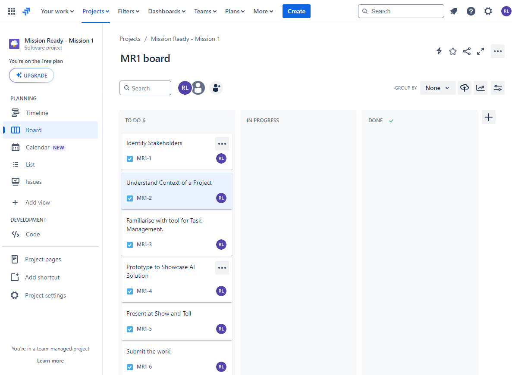
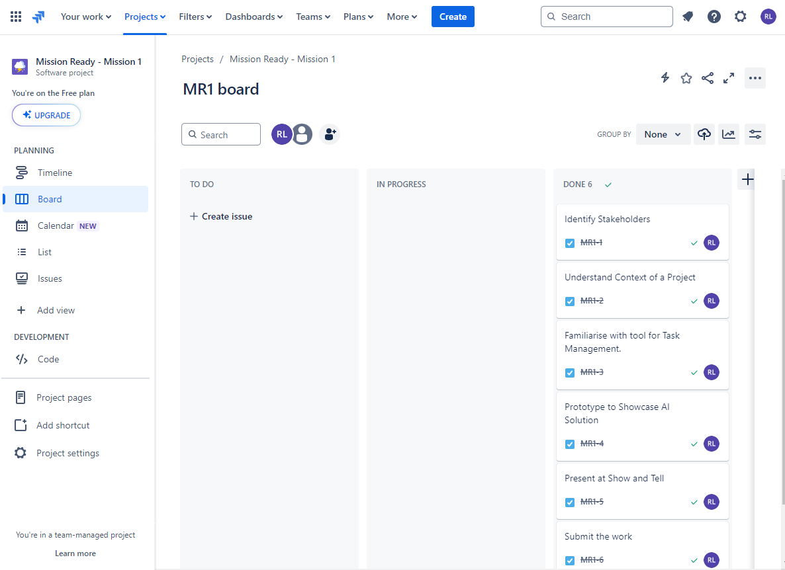

# Intro

This is a project I did as the Mission-1 for my Advanced Full-stack developer course at Mission Ready HQ. 

Objective of the project was to create a prototype for an insurance compnay to identify the type of the vehicle by uploading a photo.

After a bit of research I decided to use [Azure Custom Vision](https://www.customvision.ai/) as the AI Vision for the project.

I trained the model with [these images](https://1drv.ms/f/s!AvMZq0VwTfAXpfRz5ovMfPPDYiQJVw?e=0aVMMV) with each respective folder name as the tag.

The Web App should be able to detect the type of the Vehicle if it's a Hatchback, Pickup-truck, Sedan, or an Suv. (These were the vehicle types I trained the model with)

As I was running out of time I decided to use the *Custom Vision Endpoint* with a *Production-key* to access the Custom Vision API. 

By clicking *Choose File* and selecting a file in your local drive. You'll be able to get a reading as to what type of vehicle it is. You can check the web app at the link below. 

## Built with 
- [React Vite](https://vitejs.dev/)
- [TailWind CSS](https://tailwindcss.com/)

### Other Tools
- [Azure Custom Vision](https://www.customvision.ai/)

## Instructions

Use the following command to clone the repository. 

```
git clone https://github.com/romeshl/Turner-cars-custom-vision
```
You will need to create a .env file in the root folder containing the following information. You obtain them by signing up with Azure from the above link.

```
VITE_PRODUCTION_KEY=<Your key>
VITE_API_ENDPOINT=<Your end point>
```
and then the following command to install dependencies. 

```
npm install
```
and finally, following command to run the app.
```
npm run dev
```

# Mission Ready HQ - Mission 1

## Task 1: Identify Stakeholders

1.	Turners Car Auctions
2.	Project manager
3.	Project team
4.	Turners Car customers


## Task 2: Understand Context of a Project

1.	What are the primary objectives and goals of the project.
2.	What are the main timelines, dates and milestones.
3.	What technologies and tools can the team use to complete the project.
4.	Who are the key influencers or/and stakeholders.
5.	What areas should the team focus on the most for this project. 

## Task 3: Familiarise with tool for Task Management

Jira board at the beginning. 



Jira board at the end.


## Task 4: Prototype to Showcase AI Solution

For the prototype I trained a model in Azure Custom Vision to identify the type of car.

I added 4 categories of vehicles in the Custom Vision.
- Sedan
- Hatchback
- SUV
- Pickup-truck

Here the Custom Vision AI is accessed via the API in a React Vite project. 

This repository contains prototype. 

```
npm install
npm run dev
```
run the above commands after cloning the repository. 

## Task 5,6 Present at Show and Tell, Submit the project.

Presentation on the 20th June 2024 and Uploaded on the same day. 
